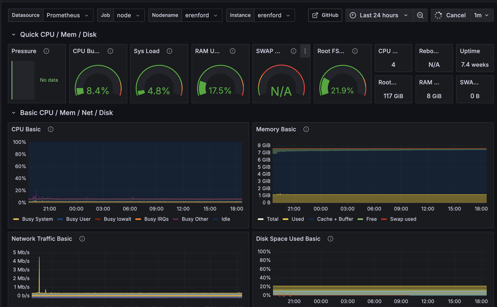

# Grafana

_This, the next "article" (on [Loki](./044_loki.md)), and the successive one (on [Vector](./045_vector.md)), are occurring mostly in parallel so that I can validate these services as I go._

I (minimally) set up Vector first, then Loki, then Grafana, just to verify I _could_ pass info around in some coherent fashion and see it in Grafana. However, that's not really sufficient.

The fact is that I'm not really experienced with Grafana. I've used it to debug things, I've installed and managed it, I've created and updated dashboards, etc. But I don't have a deep understanding of it or its featureset.

At work, we use Datadog. I love Datadog. Datadog has incredible features and a wonderful user interface. Datadog makes more money than I do, and costs more than I can afford. Also, they won't hire me, but I'm not bitter. The fact is that they don't really have a hobbyist tier, or at least not one that makes a ten-node cluster affordable.

At work, I prioritize observability. I rely heavily on logs, metrics, and traces to do my job. In my work on Goldentooth, I've been neglecting that. I've been using `journalctl` to review logs and debug services, and that's a pretty poor experience. It's recently become very, very clear that I need to have a better system here, and that means learning how to use Grafana and how to configure it best for my needs.

So, yeah, Grafana.

## Grafana

My initial installation was bog-standard, basic Grafana. Not a thing changed. It worked! Okay, let's make it better.

The first thing I did was to throw that SQLite DB on a `tmpfs`. I'm not really concerned enough about the volume or load to consider moving to something like PostgreSQL, but 1) it also doesn't matter if I keep logs/metrics past a reboot, and 2) it's probably good to avoid any writes to the SD card that I can.

Next thing was to create a new repository, [`grafana-dashboards`](https://github.com/goldentooth/grafana-dashboards/), to manage dashboards. I want a bunch of these dudes and it's better to manage them in a separate repository than in Ansible itself. I checked it out via Git, added a script to sync the repo every so often, added that to cron.

Of course, then I needed a dashboard to test it out, so I grabbed a nice one to incorporate data from Prometheus Node Exporter [here](https://github.com/rfmoz/grafana-dashboards/tree/master/prometheus). (Thanks, Ricardo F!)

Then I had to connect Grafana to Prometheus Node Exporter, then I realized I was missing a couple of command-line arguments in my Prometheus Node Exporter Helm chart that were nice to have, so I added those to the Argo CD Application, re-synced the app, etc, and finally things started showing up.

Pretty cool, I think.

